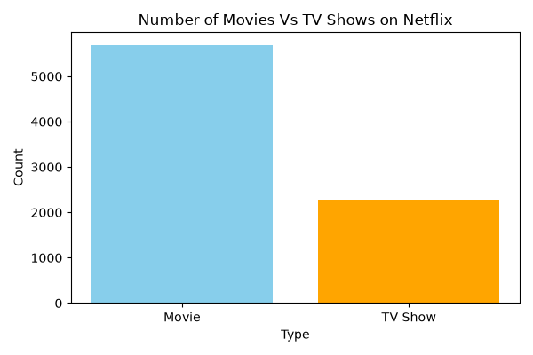
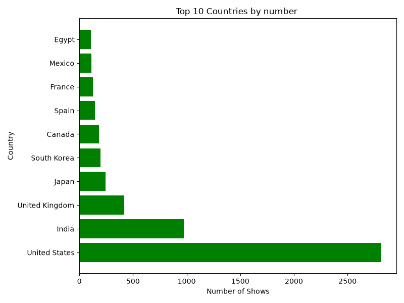
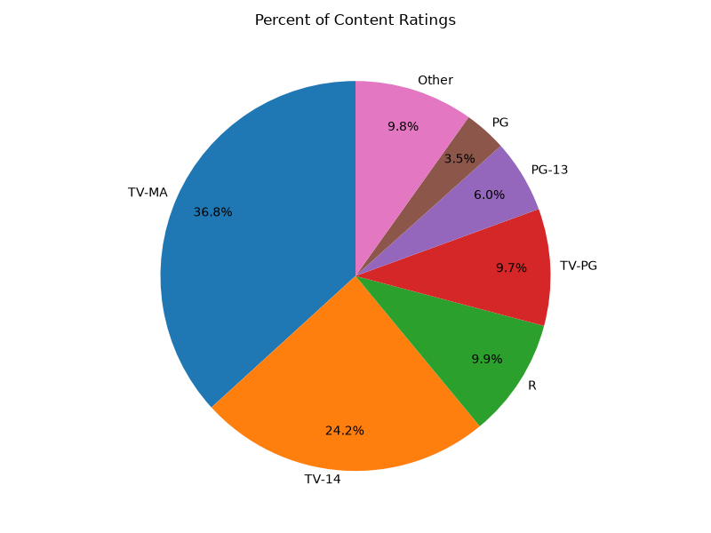
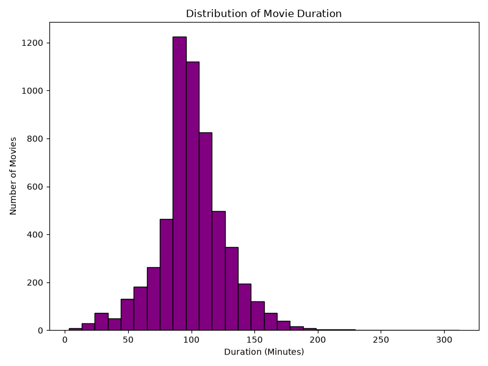
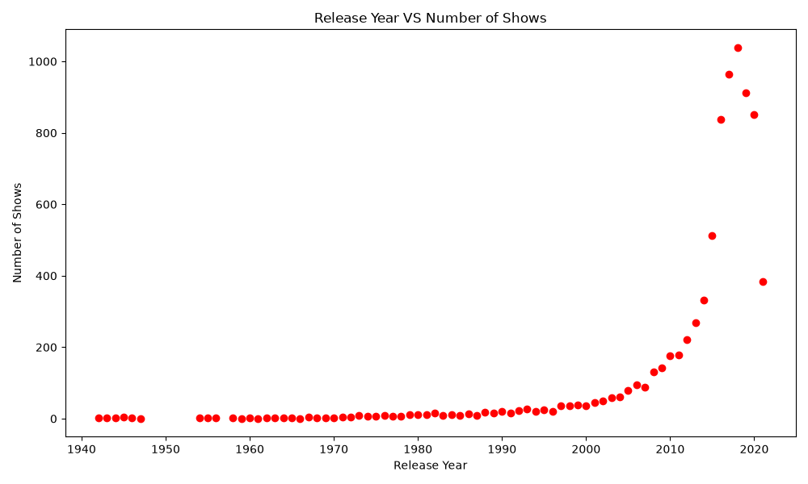
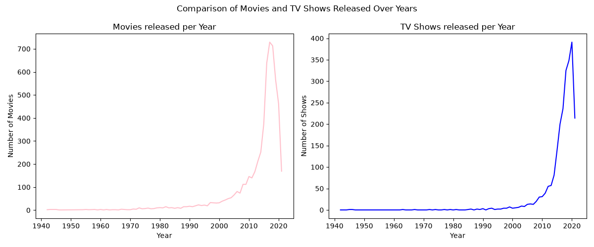

# Netflix Content Analysis 📊

Exploratory data analysis of 8,800+ Netflix titles using Python, Pandas, and Matplotlib.

## Key Insights
- Movies make up 71% of the catalog vs 29% TV Shows — but TV Show additions have grown faster since 2013
- Over 60% of content is rated TV-MA or TV-14 (mature audiences)
- Most movies run 90–110 minutes
- The US produces 3x more content than #2 India; South Korea and Japan rank in the top 8
- Movie output peaked ~2017-18, TV Show output peaked ~2020

## Visualizations

### Movies vs TV Shows


### Top 10 Countries


### Content Ratings Distribution


### Movie Duration Distribution


### Release Year Trend


### Movies vs TV Shows Over Time


## Tools Used
- Python
- Pandas
- Matplotlib

## Dataset
[Netflix Titles Dataset](link to Kaggle source or wherever you got it)

## How to Run
```bash
pip install pandas matplotlib
python netflix_analysis.py
```
